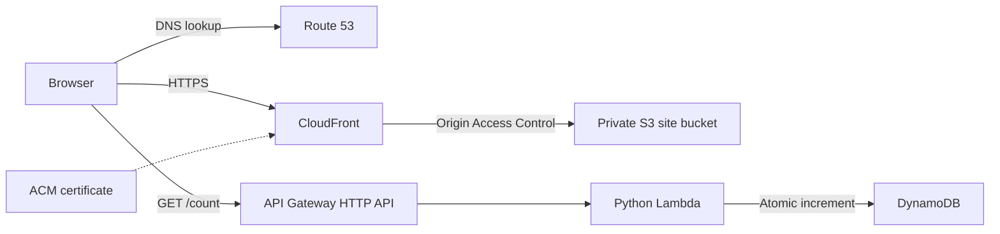

# Cloud Resume Challenge

A serverless resume website for Chris Zuck, built for the [Cloud Resume Challenge](https://cloudresumechallenge.dev). The project combines a static frontend, a Python visitor-counter API, Terraform infrastructure, and GitHub Actions deployment workflows with separate AWS roles.

**[View the live resume](https://czresume.com/)** · **[Deployment guide](docs/deployment.md)** · **[GitHub Actions](https://github.com/xgfurb/cloud-resume/actions)**

## What this project demonstrates

- Delivering a responsive HTML/CSS/JavaScript site through CloudFront with a private S3 origin.
- Building a Lambda API that atomically updates a DynamoDB counter.
- Managing infrastructure and Lambda releases through Terraform with remote state and locking.
- Separating PR planning, frontend publishing, and production infrastructure permissions.
- Testing backend behavior, browser interactions, and IAM policy boundaries before deployment.

The frontend includes light/dark themes with a saved preference, a visitor badge, and a layout adapted for desktop and mobile screens. It has no frontend build step.

## Architecture



CloudFront serves the resume files. JavaScript calls the API separately, and Lambda increments `visit_count` using DynamoDB's atomic `ADD` operation. Each successful API invocation increments the counter; it is a request counter, not a count of unique people.

| Layer | Implementation |
|---|---|
| Frontend | HTML, CSS, JavaScript; S3 and CloudFront |
| API | API Gateway HTTP API and Python 3.12 Lambda |
| Data | DynamoDB with on-demand billing |
| DNS and TLS | Route 53 and ACM |
| Email DNS | SimpleLogin verification, MX, SPF, DKIM, and DMARC records |
| Infrastructure | Terraform 1.15.4; S3 state with native lockfile locking |
| CI/CD | GitHub Actions; OIDC temporary AWS credentials |
| Checks | pytest/moto, HTMLHint, Playwright, and mocked Terraform policy tests |

## Delivery workflow

Changes land through pull requests. The main-branch ruleset requires a PR and the aggregate `checks` status check. The plan job runs on every PR, but skips Terraform operations when no relevant files changed, while the aggregate gate still requires application and security checks.

| Change | PR checks | After merge to `main` |
|---|---|---|
| Frontend | HTMLHint and desktop/mobile browser tests | S3 sync and CloudFront invalidation |
| Backend | Backend tests and Terraform checks/plan | Production approval, backend tests, Terraform plan/apply |
| Infrastructure, excluding bootstrap | Formatting, validation, policy tests, and plan | Production approval, backend tests, Terraform plan/apply |
| README/documentation only | Application/security checks; Terraform skips infrastructure work | No application deployment |

Test dependencies and relevant workflow-file changes also trigger checks. Exact path filters are defined in [.github/workflows](.github/workflows).

**Terraform is the sole owner of Lambda releases.** There is no separate workflow uploading Lambda code. Infrastructure deployment saves a plan and applies that same file. Production approval gates the job before planning; it does not approve the exact plan generated later in the job.

Deployments are serialized per target, and queued runs reject newer changes affecting that target to prevent stale deployments. An in-progress Terraform apply is not cancelled by a newer run.

Fork PRs receive static Terraform validation and mocked policy tests without AWS credentials. A maintainer must review and plan those changes on a trusted branch before merging.

## Security and access

GitHub Actions uses OIDC to obtain temporary AWS credentials instead of storing long-lived AWS access keys in GitHub. Trust policies and permission policies serve different purposes: the former select who can assume a role; the latter limit what that role can do.

| Role | Trusted context | Access |
|---|---|---|
| `cloud-resume-github-plan` | Repository pull requests | Infrastructure/state reads and state lockfile management |
| `cloud-resume-github-frontend` | Repository `main` branch | Site bucket sync and CloudFront invalidation |
| `cloud-resume-github-actions` | Repository `production` environment | Infrastructure deployment; no IAM mutation |

CI cannot change role policies or the OIDC provider. PR planning reads are scoped to project resources and exclude counter data reads. The apply role can pass only the existing Lambda execution role to Lambda. IAM changes remain in Terraform, but must be applied with a suitably authorized administrative identity.

Other controls include:

- S3 public access blocking and CloudFront Origin Access Control.
- HTTPS redirection and an ACM certificate on CloudFront.
- API CORS restricted to the resume domains, one request/second throttling (burst five). A two-execution Lambda reservation is configurable after an account quota increase; currently Lambda uses the shared account pool. The counter remains a public endpoint; CORS is not authentication.
- Versioned, encrypted, non-public Terraform state with a separate S3 lockfile.
- Production deployments restricted to `main`, with the sole administrator as reviewer, self-approval allowed, and administrator bypass disabled.
- CloudFront CSP, HSTS, framing and MIME-sniffing protection, plus a referrer policy.
- Required aggregate CI checks, weekly secret/dependency scans, and Dependabot updates.
- Commit-pinned GitHub Actions, pinned Python test dependencies, and committed npm/Terraform lockfiles.

The plan role can read state, which can contain sensitive information. Some resource identifiers use account-scoped wildcards for DNS change records and CloudFront response-header policies. The policy tests check declared permissions; they do not replace verification of effective AWS authorization.

## Local development

Run the commands below from the repository root. Use Python 3.12 and Terraform 1.15.4 for CI parity, plus Node.js with npm. [mise.toml](mise.toml) pins Terraform and configures the AWS CLI. AWS credentials are needed for live infrastructure planning, not for backend or browser tests.

### Backend tests

Create a virtual environment outside the repository, then install the pinned test dependencies:

```bash
python3.12 -m venv ../cloud-resume-venv
source ../cloud-resume-venv/bin/activate
python -m pip install -r backend/requirements-test.txt
python -m pytest backend/counter/test_counter.py -v
```

The seven tests cover increment behavior, JSON responses, persistence, creation of a missing counter, and a generic error response when DynamoDB fails. Moto supplies a simulated AWS environment.

### Frontend checks

```bash
npm ci
npm run lint
npx playwright install chromium
npm test
```

On Linux, `npx playwright install --with-deps chromium` can also install the browser's system dependencies. To use an existing Chromium installation instead:

```bash
CHROMIUM_PATH=/usr/bin/chromium npm test
```

The browser tests run at desktop and mobile widths and check layout, theme persistence, and counter success/failure behavior. All network requests are fulfilled locally, so these tests never increment the live counter.

To preview the actual page locally:

```bash
python -m http.server 8000 --bind 127.0.0.1 --directory frontend
```

Open [localhost:8000](http://localhost:8000). The page currently points to the live counter API. Localhost is outside its allowed CORS origins, so the badge may show a dash even though the request can increment the counter. Use the browser tests for isolated counter testing.

### Terraform validation

For a fresh checkout, initialize providers without connecting to the remote state backend, then run offline configuration checks:

```bash
terraform -chdir=terraform init -backend=false -lockfile=readonly
terraform -chdir=terraform fmt -check -recursive
terraform -chdir=terraform validate
terraform -chdir=terraform test
```

The policy tests mock AWS and do not create cloud resources. For a live plan, configure an authorized AWS identity and initialize the remote backend:

```bash
terraform -chdir=terraform init -lockfile=readonly
terraform -chdir=terraform plan -lock-timeout=60s
```

The separate `terraform/bootstrap` configuration manages the state bucket, a legacy DynamoDB lock table, and the project dev IAM user. The main configuration uses S3 lockfiles, not that DynamoDB table. Bootstrap is excluded from automated deployment; see the [deployment guide](docs/deployment.md) before changing it.

## Repository guide

| Path | Purpose |
|---|---|
| [frontend/](frontend) | Resume markup, theme/counter JavaScript, and CSS |
| [backend/counter/](backend/counter) | Lambda handler and backend tests |
| [backend/requirements-test.txt](backend/requirements-test.txt) | Pinned Python test dependencies |
| [tests/frontend.test.mjs](tests/frontend.test.mjs) | Browser tests with mocked network responses |
| [terraform/main.tf](terraform/main.tf) | Site bucket, CloudFront, DNS, and TLS |
| [terraform/backend.tf](terraform/backend.tf) | Counter table, Lambda, API, and execution-role permissions |
| [terraform/cicd.tf](terraform/cicd.tf) | OIDC provider and the three CI roles |
| [terraform/providers.tf](terraform/providers.tf) | Provider constraints and remote state configuration |
| [terraform/email.tf](terraform/email.tf) | SimpleLogin DNS records |
| [terraform/tests/](terraform/tests) | Mocked IAM policy assertions |
| [terraform/bootstrap/](terraform/bootstrap) | Separately managed bootstrap resources |
| [.github/workflows/](.github/workflows) | PR checks and production deployment workflows |
| [docs/deployment.md](docs/deployment.md) | IAM migration history, operational steps, and GitHub variables |

## Deployment configuration

The workflows use these GitHub Actions variables:

| Variable | Location | Terraform output |
|---|---|---|
| `AWS_PLAN_ROLE_ARN` | Repository | `github_plan_role_arn` |
| `AWS_FRONTEND_ROLE_ARN` | Repository | `github_frontend_role_arn` |
| `AWS_APPLY_ROLE_ARN` | `production` environment | `github_actions_role_arn` |
| `S3_BUCKET_NAME` | Repository | `s3_bucket_name` |
| `CLOUDFRONT_DISTRIBUTION_ID` | Repository | `cloudfront_distribution_id` |

The former shared `AWS_ROLE_ARN` variable is retired. Existing installations should follow the [deployment guide](docs/deployment.md) for IAM changes; its one-time role migration has already been completed for this repository.

This configuration includes project-specific domain names, state storage, account identifiers, and repository trust subjects. Review those values before adapting it to another AWS account or GitHub repository.

## Project context

Built as a practical Cloud Resume Challenge project, with development assistance from Claude Code and OpenAI Codex. The live resume credits AWS, Terraform, GitHub Actions, and both development tools.
